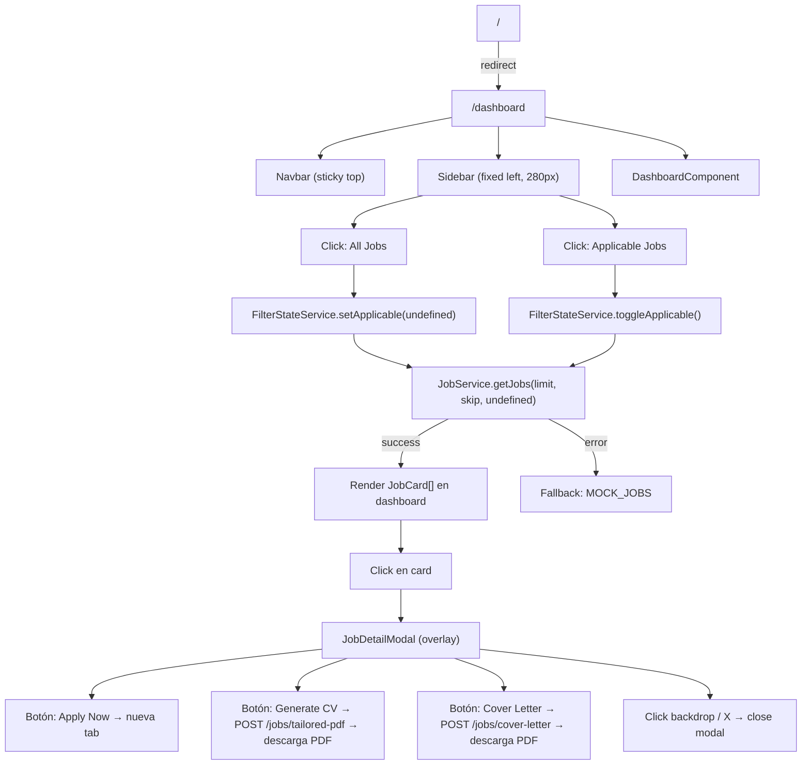
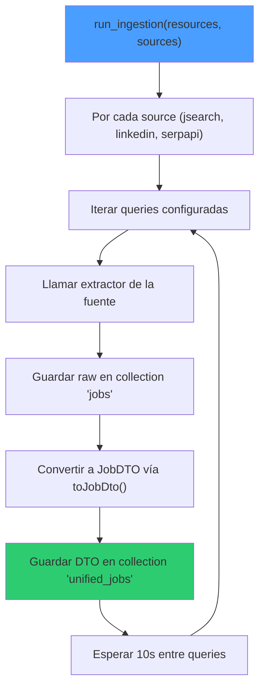
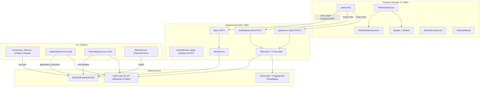
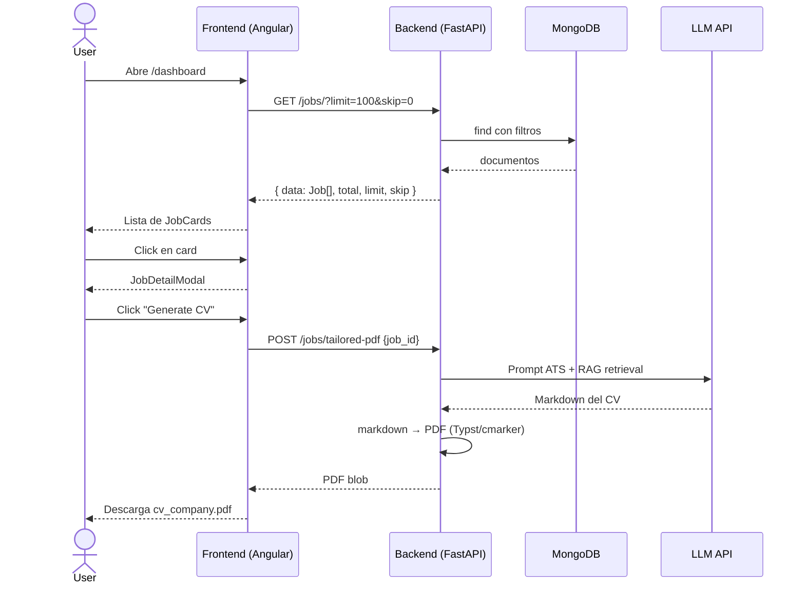

---
tags:
  - "#proyecto"
  - "#estado/activo"
  - "#prioridad/alta"
  - "#tema/arquitectura"
fecha: 2026-05-21
---

# JobSearcher — Arquitectura del Sistema

## 🧭 Visión General

JobSearcher (Frontend: **TalentMatch**) es una plataforma de búsqueda de empleo con análisis automático mediante LLM. Consta de dos aplicaciones:

- **Frontend:** Angular 17 standalone (sin NgModules), servido en puerto **8501**
- **Backend:** FastAPI + Python 3.14, servido en puerto **8000** (proxied desde Angular en dev)
- **Base de datos:** MongoDB (`jobsearcher`)
- **LLM:** OpenCode Go API (`deepseek-v4-flash`) vía LangChain
- **Cola de iconos:** Google Material Symbols Outlined
- **Fuentes:** Inter (body) + JetBrains Mono (código/datos)

---

## 🖥️ Frontend — TalentMatch (Angular 17)

### 🔀 Flujo de Navegación



### 📄 Componentes

> **Nota:** Todos los componentes son *standalone* (Angular 17+). No existen NgModules.

#### Páginas

| Componente | Ruta | Descripción |
|---|---|---|
| `DashboardComponent` | `/dashboard` | Única página real de la app. Lista las ofertas, maneja filtros, abre el modal de detalle. |

#### Componentes de Layout

| Componente | Descripción |
|---|---|
| `NavbarComponent` | Barra superior sticky con scroll-shadow. Muestra el brand "TalentMatch", enlaces (Dashboard activo, Applications placeholder), iconos de notificaciones y settings (sin lógica aún). |
| `SidebarComponent` | Sidebar fijo izquierdo (280px, oculto en móvil). Dos items: "All Jobs" y "Applicable Jobs". Conecta con `FilterStateService`. |

#### Componentes de Funcionalidad

| Componente | Inputs | Outputs | Descripción |
|---|---|---|---|
| `JobCardComponent` | `job: Job` (required) | `viewDetails: EventEmitter<Job>` | Tarjeta individual de oferta. Muestra logo, empresa, título, ubicación, salario, descripción (2 líneas), tags, y un anillo SVG de % de match. 3 botones de acción. |
| `JobDetailModalComponent` | `job: Job` (required) | `close: EventEmitter<void>` | Modal full-screen (z-100) con backdrop blur. Muestra la info completa de la oferta + botones de acción. Cierra con X o click en backdrop. |

### 🔘 Botones y Acciones

| Botón | Ubicación | Acción |
|---|---|---|
| **All Jobs** | Sidebar | `filterState.setApplicable(undefined)` → muestra todas las ofertas |
| **Applicable Jobs** | Sidebar | `filterState.toggleApplicable()` → alterna `true` / `undefined` |
| **Generate CV** | JobCard + JobDetailModal | `jobService.generateTailoredPdf(job.jobId)` → POST → descarga PDF como `cv_{company}.pdf` |
| **Cover Letter** | JobCard + JobDetailModal | `jobService.generateCoverLetterPdf(job.jobId)` → POST → descarga PDF como `cover_letter_{company}.pdf` |
| **Apply Now** | JobCard + JobDetailModal | Abre `job.applyLink` en nueva pestaña con `noopener,noreferrer` |
| **Sort by** | Dashboard header | Placeholder visual, sin funcionalidad |
| **Filters** | Dashboard header | Placeholder visual, sin funcionalidad |
| **Applications** | Navbar | Placeholder visual (`href="#"`), sin routerLink |
| **🔔 Notifications** | Navbar | Placeholder, sin handler |
| **⚙ Settings** | Navbar | Placeholder, sin handler |

### 🔧 Servicios

#### `JobService` (`src/app/services/job.service.ts`)

Servicio singleton (`providedIn: 'root'`).

| Método | HTTP | Endpoint | Retorno | Notas |
|---|---|---|---|---|
| `getJobs(limit, skip, applicable?)` | GET | `/api/jobs/` | `Observable<JobsResponse>` | Con `catchError` → fallback a `MOCK_JOBS` |
| `generateTailoredPdf(jobId)` | POST | `/api/jobs/tailored-pdf` | `Observable<Blob>` | Body: `{job_id}` |
| `generateCoverLetterPdf(jobId)` | POST | `/api/jobs/cover-letter` | `Observable<Blob>` | Body: `{job_id}` |

#### `FilterStateService` (`src/app/services/filter-state.service.ts`)

Estado reactivo mínimo con un `BehaviorSubject<boolean | undefined>`:

- `undefined` → mostrar todas las ofertas
- `true` → solo ofertas aplicables

Métodos: `setApplicable(value)`, `getApplicable()`, `toggleApplicable()`, `applicable$` (observable).

### 📦 Modelo de Datos

```typescript
interface Job {
  id: number; jobId: string;
  company: string; title: string; location: string;
  salary: string; matchPercentage: number;
  logoUrl: string; description: string;
  tags: string[]; postedDate: string;
  applicable?: boolean; applyLink?: string;
  saved?: boolean; applied?: boolean;
  responsibilities?: string[]; requirements?: string[];
}
```

### 🛠️ Utilidades

No existen archivos de utilidades dedicados. La lógica reutilizable está inline:

- **Cálculo de anillo de match:** `matchOffset` getter en `JobCardComponent` y duplicado inline en `JobDetailModalComponent`. Fórmula: `circumference * (1 - matchPercentage / 100)`. Circunferencia ≈ 175.9.
- **Nombre de archivo seguro:** `.replace(/\s+/g, '_').toLowerCase()` duplicado en ambos componentes.
- **Fallback de logo:** Si la imagen falla, muestra la primera letra del nombre de la empresa.

### 🔌 Proxy de Desarrollo

`proxy.conf.json` reescribe `/api/*` → `http://localhost:8000/*`, eliminando el prefijo `/api` antes de enviar al backend.

---

## ⚙️ Backend — FastAPI + Python 3.14

### 🌐 API Endpoints

Router prefix: `/jobs`

| Método | Path | Propósito | Params/Body |
|---|---|---|---|
| `GET` | `/jobs/` | Listar ofertas con paginación y filtros | `limit` (1-500), `skip` (≥0), `applicable` (bool), `saved` (bool), `applied` (bool) |
| `POST` | `/jobs/{job_id}/save` | Marcar/desmarcar como guardada | `{"saved": bool}` |
| `POST` | `/jobs/{job_id}/apply` | Marcar/desmarcar como aplicada | `{"applied": bool}` |
| `POST` | `/jobs/{job_id}/feedback` | Enviar feedback sobre una oferta | `{"rating": int, "reasons": [str]}` |
| `POST` | `/jobs/tailored-pdf` | Generar CV adaptado (PDF) | `{"job_id": str}` → descarga PDF |
| `POST` | `/jobs/cover-letter` | Generar cover letter (PDF) | `{"job_id": str}` → descarga PDF |

**Health check:** `GET /health` → `{"status": "ok"}`

### 🧩 Servicios Implementados

| Servicio | Archivo | Responsabilidad |
|---|---|---|
| `JobsService` | `application/service/jobs_service.py` | Recupera ofertas de MongoDB con filtros (`applicable`, `saved`, `applied`). Convierte DTOs a formato frontend. |
| `ApplicableService` | `application/service/applicable_service.py` | **ETL Paso 1:** Usa LLM para determinar si una oferta es aplicable (remoto/Alemania + inglés). Escribe `applicable`, `processed`, `_applicable_reason`. |
| `TechnologyService` | `application/service/technology_service.py` | **ETL Paso 2:** Usa LLM para extraer array de tecnologías del título+descripción contra una lista de ~150 términos. Solo ofertas aplicables. |
| `MatchService` | `application/service/match_service.py` | **ETL Paso 3:** Determinístico. Compara tecnologías extraídas contra el CV del candidato (~20 alias mapeados). Match = (matched / total) × 100. |
| `TransformationOrchestrator` | `application/service/transformation.py` | Orquestador: ejecuta los 3 pasos secuencialmente. |
| `LLMConfig` | `application/service/llm_config.py` | Fábrica de `ChatOpenAI` apuntando a `https://opencode.ai/zen/go/v1` con `deepseek-v4-flash`, temp=0, max_tokens=4096. |
| `TailoredCV` | `application/service/tailored_cv.py` | Generación on-demand de CV PDF: LLM + RAG (ChromaDB + HuggingFace embeddings sobre `resume-tips-for-engineering-majors.pdf`) + conversión markdown→PDF vía Typst/cmarker. Cache en `resources/applications/{slug}-{job_id}/`. Con `threading.Lock` por job_id. |
| `CoverLetter` | `application/service/cover_letter.py` | Generación on-demand de cover letter PDF: LLM + conversión markdown→PDF. Cache igual que TailoredCV. |
| `JobConverter` | `application/service/job_converter.py` | Convierte `JobDTO` → diccionario frontend. Extrae tags (máx 10), extensions, highlights, qualifications, benefits. Formatea fechas. |

### 🔄 Pipeline ETL

El pipeline se divide en dos fases: **Extracción** (ingestión de datos) y **Transformación** (enriquecimiento con LLM).

#### Fase A: Extracción (Data Ingestion)

**Entry point:** `application/extractors/data_ingestion.py → run_ingestion()`



**Fuentes de extracción:**

| Fuente | API | Queries | Países | Filtros |
|---|---|---|---|---|
| **JSearch** | RapidAPI `jsearch.p.rapidapi.com/search-v2` | "Senior Software Engineer Java", "Team Lead", "Software Architect", "AI Engineer" | de, gb, nl, fr, es | remote, full-time, >3yr exp, last week |
| **LinkedIn** | RapidAPI `linkedin-job-search-api.p.rapidapi.com` | Mismas 4 queries | 13 países europeos | full-time, last 7 days |
| **SerpApi** | `serpapi.com/search` (Google Jobs) | "remote in Europe" | — | Google Jobs filters |

**Disparadores (cron externo):**
- `run_weekly.sh` → ejecuta `jsearch_cron.sh` + `linkedin_cron.sh` + `python -m application.service.transformation`
- `run_full_pipeline.py` → ejecución manual, loop hasta procesar todos los documentos pendientes

#### Fase B: Transformación

**Entry point:** `application/service/transformation.py → run_pipeline()`

```mermaid
graph LR
    A["MongoDB unified_jobs"] --> B["Paso 1: ApplicableService"]
    B -->|"LLM decide si es aplicable"| C["Campos: applicable, processed, _applicable_reason"]
    C --> D["Paso 2: TechnologyService"]
    D -->|"LLM extrae tecnologías"| E["Campo: technologies (array)"]
    E --> F["Paso 3: MatchService"]
    F -->|"Comparación determinística con CV"| G["Campo: match (0-100)"]

    style B fill:#e74c3c
    style D fill:#f39c12
    style F fill:#2ecc71
```



Cada paso es **idempotente**: solo procesa documentos que no tienen el campo destino ya poblado.

**Paso 1 — Applicable (LLM):**
- Query: docs sin `processed=true`
- Prompt: título, ubicación, país, is_remote, primeros 3000 chars de descripción
- Output LLM: `{"applicable": true/false, "reason": "..."}`
- Criterio: ¿Es remoto o en Alemania? ¿Descripción en inglés?

**Paso 2 — Technology Extraction (LLM):**
- Query: docs con `applicable=true` y sin `technologies`
- Prompt: título + primeros 3000 chars de descripción
- Output LLM: array ordenado de tecnologías (contra lista curada de ~150 términos)

**Paso 3 — Match Score (Determinístico):**
- Query: docs con `technologies` no vacío y sin `match`
- Algoritmo: por cada tecnología extraída, verificar si existe en el skillset del CV
- Mapeo de alias (~20): "Golang"→"go", "K8s"→"kubernetes", "Amazon Web Services"→"aws", etc.
- Fórmula: `match = (matched_count / total_technologies) × 100`

### 🗃️ Modelo de Datos (MongoDB)

**Database:** `jobsearcher`

**Colecciones:**

| Colección | Uso |
|---|---|
| `jobs` | Resultados raw de los extractores (antes de normalizar) |
| `unified_jobs` | Documentos normalizados (JobDTO) — colección principal |

**Campos principales de `unified_jobs`:**

| Campo | Tipo | Origen |
|---|---|---|
| `job_id` | string | ID de la fuente |
| `title`, `company`, `description` | string | Fuente |
| `location`, `country`, `city`, `state` | string | Fuente |
| `is_remote` | bool | Fuente |
| `posted_at`, `posted_at_datetime` | string | Fuente |
| `salary_string`, `salary_min`, `salary_max`, `salary_period` | string/int | Fuente |
| `employment_type` | string | Fuente |
| `apply_link` | string | Fuente (índice único parcial) |
| `publisher`, `employer_logo`, `employer_website` | string | Fuente |
| `benefits`, `highlights`, `qualifications`, `extensions` | list/dict | Fuente |
| `source`, `role_query`, `fetched_at` | string/datetime | Extractor |
| `applicable`, `processed`, `_applicable_reason` | bool/string | **ETL Paso 1** |
| `technologies` | list[str] | **ETL Paso 2** |
| `match` | int (0-100) | **ETL Paso 3** |
| `saved`, `applied`, `applied_at` | bool/datetime | Interacción usuario |
| `feedback` | dict | Interacción usuario |
| `responsibilities`, `requirements` | list[str] | Parseado de descripción |

---

## 📊 Diagrama de Arquitectura General



## 📊 Diagrama de Flujo de Usuario



## 📁 Estructura del Proyecto

```
/opt/jobsearcher/
├── frontend/                    # Angular 17 standalone
│   └── src/app/
│       ├── app.config.ts        # Router + HttpClient providers
│       ├── app.routes.ts        # / → /dashboard
│       ├── pages/dashboard/     # DashboardComponent
│       ├── components/
│       │   ├── navbar/          # NavbarComponent
│       │   ├── sidebar/         # SidebarComponent
│       │   ├── job-card/        # JobCardComponent
│       │   └── job-detail-modal/# JobDetailModalComponent
│       ├── services/
│       │   ├── job.service.ts
│       │   └── filter-state.service.ts
│       └── models/job.model.ts
├── backend/                     # FastAPI + Python 3.14
│   ├── main.py                  # Entry point (uvicorn)
│   ├── application/
│   │   ├── api/
│   │   │   ├── main.py          # FastAPI app + /health
│   │   │   └── controllers/     # jobs_controller.py (6 endpoints)
│   │   ├── extractors/          # JSearch, LinkedIn, SerpApi
│   │   ├── service/             # Lógica de negocio
│   │   └── dtos/                # JobDTO dataclass
│   ├── core/                    # Acceso a MongoDB
│   ├── scripts/                 # Utilidades CLI
│   └── resources/               # CV.md, PDF, prompts
├── devops/                      # docker-compose.yml + .env
└── docs/                        # Vault de Obsidian
```

---

## 🔗 Relacionado

- [[frontend-setup]] — Configuración del entorno Angular
- [[backend-setup]] — Configuración del entorno FastAPI
- [[etl-pipeline]] — Detalle del pipeline ETL
- [[mongodb-schema]] — Esquema completo de MongoDB
- [[llm-integration]] — Integración con OpenCode Go API
